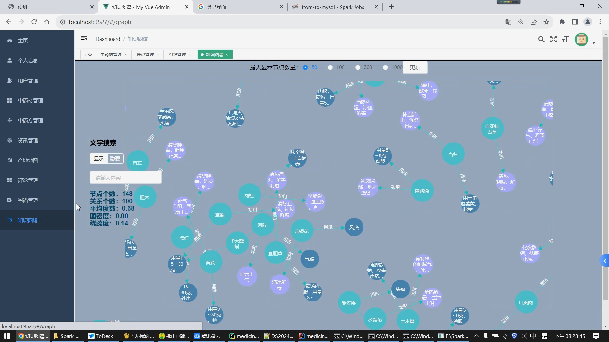
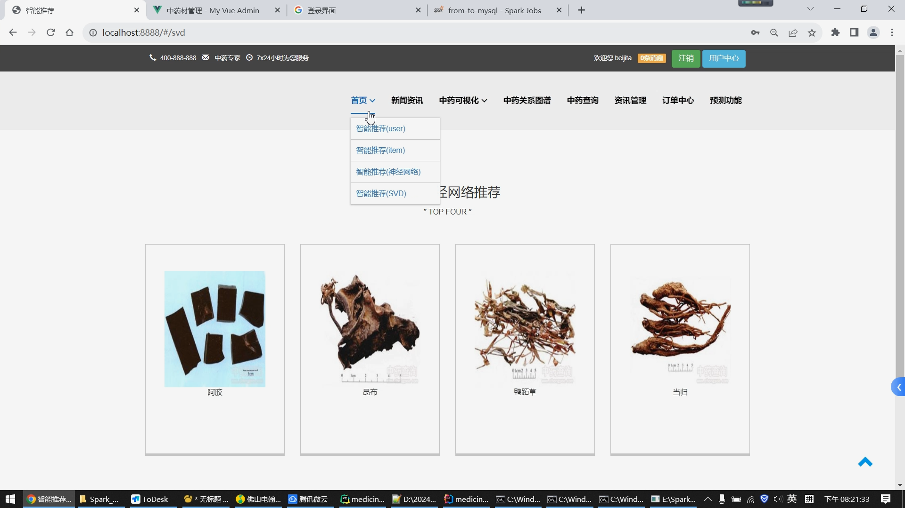
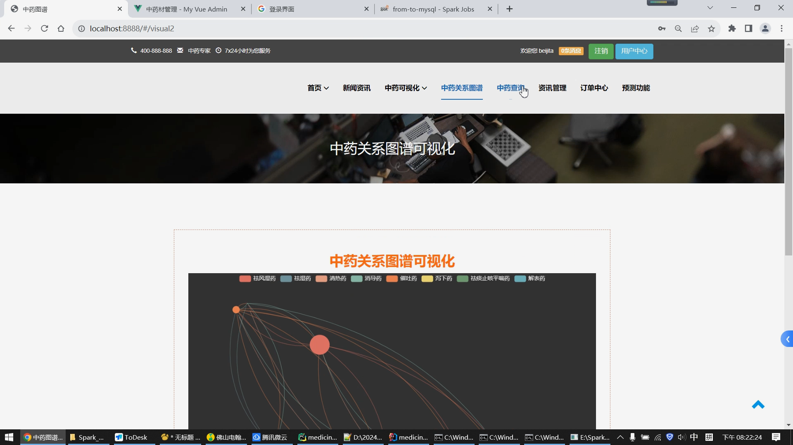

## 计算机毕业设计Spark+PyTorch知识图谱中药推荐系统 中药数据分析可视化大屏 中药爬虫 机器学习 中药预测系统 中药情感分析 大数据毕业设计

## 要求
### 源码有偿！一套(论文 PPT 源码+sql脚本+教程)

### 
### 加好友前帮忙start一下，并备注github有偿图谱中药25
### 我的QQ号是2827724252或者798059319或者 1679232425或者微信:bysj2023nb 或bysj1688

# 

### 加qq好友说明（被部分 网友整得心力交瘁）：
    1.加好友务必按照格式备注
    2.避免浪费各自的时间！
    3.当“客服”不容易，repo 主是体面人，不爆粗，性格好，文明人。
	
	
## 介绍
### 创新点：知识图谱、大数据虚拟机、可视化大屏、python爬虫、lstm深度学习情感分析、spark+hadoop+hive离线计算实时计算全部实现、前后台完整、支付宝沙箱支付、短信、AI识别、4-20种推荐算法、中药价格机器学习预测算法等上百种创新点吊打导师，摩擦答辩现场！
### 开发技术：spark hive hadoop springboot vue.js echarts 阿里云平台 百度AI平台 lstm情感分析模型 KNN CNN卷积神经 SVD神经网络 MLP模型推荐 协同过滤算法

## 演示视频
https://www.bilibili.com/video/BV1YW421N7vn

https://www.bilibili.com/video/BV1cxH4e4Etu/

## 运行效果图

